# core/ & integrations/ Dependency Graph

_Generated by `scripts/arch_dependency_graph.py`._

## Package-level Graph

```mermaid
graph TD;
    core["core"]
    core_agent_kit["core.agent_kit"]
    core_app["core.app"]
    core_application["core.application"]
    core_backup["core.backup"]
    core_benchmarks["core.benchmarks"]
    core_cli["core.cli"]
    core_cli_commands["core.cli.commands"]
    core_cognitive["core.cognitive"]
    core_cognitive_graph["core.cognitive_graph"]
    core_embeddings["core.embeddings"]
    core_evidence["core.evidence"]
    core_hephaestus["core.hephaestus"]
    core_kia["core.kia"]
    core_migrations["core.migrations"]
    core_migrations_model_call_ledger_reconcile["core.migrations.model_call_ledger_reconcile"]
    core_ops["core.ops"]
    core_persona["core.persona"]
    core_privacy["core.privacy"]
    core_reflection["core.reflection"]
    core_role["core.role"]
    core_scoring["core.scoring"]
    core_scoring_scorers["core.scoring.scorers"]
    core_setup["core.setup"]
    core_sync_framework["core.sync_framework"]
    core_telemetry["core.telemetry"]
    core_telemetry_model_call_ledger["core.telemetry.model_call_ledger"]
    core_trust["core.trust"]
    core_vaults["core.vaults"]
    integrations["integrations"]
    integrations_agora_tools["integrations.agora_tools"]
    integrations_backends["integrations.backends"]
    integrations_sources["integrations.sources"]
    mnemos_cli["mnemos_cli"]
    mnemos_daemon["mnemos_daemon"]
    core --> core_agent_kit
    core --> core_backup
    core --> core_cli
    core --> core_cognitive
    core --> core_evidence
    core --> core_hephaestus
    core --> core_kia
    core --> core_migrations
    core --> core_ops
    core --> core_privacy
    core --> core_reflection
    core --> core_role
    core --> core_scoring
    core --> core_setup
    core --> core_sync_framework
    core --> core_trust
    core_agent_kit --> core
    core_agent_kit --> core_ops
    core_agent_kit --> core_sync_framework
    core_agent_kit --> core_trust
    core_app --> core
    core_app --> core_cognitive
    core_app --> core_kia
    core_app --> core_ops
    core_app --> core_persona
    core_app --> core_scoring
    core_app --> core_telemetry
    core_app --> core_trust
    core_application --> core
    core_application --> core_agent_kit
    core_application --> core_app
    core_application --> core_cognitive
    core_application --> core_evidence
    core_application --> core_hephaestus
    core_application --> core_kia
    core_application --> core_ops
    core_application --> core_persona
    core_application --> core_privacy
    core_application --> core_reflection
    core_application --> core_sync_framework
    core_application --> core_trust
    core_application --> integrations
    core_backup --> core
    core_backup --> core_ops
    core_benchmarks --> core
    core_cli --> core
    core_cli --> core_vaults
    core_cli_commands --> core
    core_cli_commands --> core_agent_kit
    core_cli_commands --> core_app
    core_cli_commands --> core_application
    core_cli_commands --> core_backup
    core_cli_commands --> core_cli
    core_cli_commands --> core_cognitive
    core_cli_commands --> core_hephaestus
    core_cli_commands --> core_kia
    core_cli_commands --> core_migrations
    core_cli_commands --> core_ops
    core_cli_commands --> core_persona
    core_cli_commands --> core_privacy
    core_cli_commands --> core_reflection
    core_cli_commands --> core_setup
    core_cli_commands --> core_sync_framework
    core_cli_commands --> core_trust
    core_cli_commands --> core_vaults
    core_cli_commands --> integrations
    core_cli_commands --> mnemos_cli
    core_cognitive --> core
    core_cognitive --> core_application
    core_cognitive --> core_cognitive_graph
    core_cognitive --> core_evidence
    core_cognitive --> core_hephaestus
    core_cognitive --> core_kia
    core_cognitive --> core_migrations
    core_cognitive --> core_migrations_model_call_ledger_reconcile
    core_cognitive --> core_ops
    core_cognitive --> core_privacy
    core_cognitive --> core_scoring
    core_cognitive --> core_sync_framework
    core_cognitive --> core_trust
    core_cognitive_graph --> core
    core_cognitive_graph --> core_cognitive
    core_cognitive_graph --> core_privacy
    core_cognitive_graph --> core_trust
    core_embeddings --> core
    core_embeddings --> core_cognitive
    core_embeddings --> core_telemetry
    core_evidence --> core
    core_evidence --> core_cognitive
    core_evidence --> core_privacy
    core_evidence --> core_reflection
    core_evidence --> core_sync_framework
    core_hephaestus --> core
    core_hephaestus --> core_app
    core_hephaestus --> core_cli
    core_hephaestus --> core_cognitive
    core_hephaestus --> core_evidence
    core_hephaestus --> core_kia
    core_hephaestus --> core_migrations_model_call_ledger_reconcile
    core_hephaestus --> core_ops
    core_hephaestus --> core_privacy
    core_hephaestus --> core_reflection
    core_hephaestus --> core_scoring_scorers
    core_hephaestus --> core_sync_framework
    core_hephaestus --> core_telemetry
    core_hephaestus --> core_telemetry_model_call_ledger
    core_hephaestus --> core_trust
    core_hephaestus --> core_vaults
    core_kia --> core
    core_kia --> core_application
    core_kia --> core_cli
    core_kia --> core_cognitive
    core_kia --> core_embeddings
    core_kia --> core_hephaestus
    core_kia --> core_ops
    core_kia --> core_persona
    core_kia --> core_sync_framework
    core_kia --> core_telemetry
    core_kia --> core_trust
    core_kia --> core_vaults
    core_migrations --> core
    core_migrations --> core_cognitive
    core_migrations --> core_migrations_model_call_ledger_reconcile
    core_migrations --> core_ops
    core_migrations_model_call_ledger_reconcile --> core
    core_migrations_model_call_ledger_reconcile --> core_telemetry
    core_migrations_model_call_ledger_reconcile --> core_telemetry_model_call_ledger
    core_ops --> core
    core_ops --> core_backup
    core_ops --> core_benchmarks
    core_ops --> core_cognitive
    core_ops --> core_hephaestus
    core_ops --> core_kia
    core_ops --> core_migrations
    core_ops --> core_migrations_model_call_ledger_reconcile
    core_ops --> core_privacy
    core_ops --> core_setup
    core_ops --> core_sync_framework
    core_ops --> core_telemetry
    core_ops --> core_trust
    core_ops --> core_vaults
    core_persona --> core
    core_persona --> core_cognitive
    core_persona --> core_evidence
    core_persona --> core_privacy
    core_persona --> core_trust
    core_privacy --> core
    core_privacy --> core_backup
    core_privacy --> core_cognitive
    core_privacy --> core_kia
    core_privacy --> core_ops
    core_privacy --> core_scoring
    core_privacy --> core_telemetry
    core_privacy --> core_trust
    core_reflection --> core
    core_reflection --> core_cognitive
    core_reflection --> core_embeddings
    core_reflection --> core_evidence
    core_reflection --> core_privacy
    core_reflection --> core_role
    core_reflection --> core_telemetry
    core_scoring --> core
    core_scoring --> core_cognitive
    core_scoring --> core_kia
    core_scoring --> core_privacy
    core_scoring --> core_telemetry
    core_scoring_scorers --> core
    core_scoring_scorers --> core_kia
    core_scoring_scorers --> core_scoring
    core_setup --> core
    core_setup --> core_backup
    core_setup --> core_cognitive
    core_setup --> core_migrations
    core_setup --> core_ops
    core_setup --> core_privacy
    core_sync_framework --> core
    core_sync_framework --> core_agent_kit
    core_sync_framework --> core_evidence
    core_sync_framework --> core_kia
    core_sync_framework --> core_ops
    core_sync_framework --> core_privacy
    core_telemetry --> core_telemetry_model_call_ledger
    core_telemetry_model_call_ledger --> core
    core_trust --> core
    core_trust --> core_cognitive
    core_vaults --> core
    integrations --> core
    integrations --> core_agent_kit
    integrations --> core_application
    integrations --> core_cli_commands
    integrations --> core_evidence
    integrations --> core_kia
    integrations --> core_ops
    integrations --> core_persona
    integrations --> core_sync_framework
    integrations --> integrations_agora_tools
    integrations --> integrations_sources
    integrations_backends --> core
    integrations_backends --> core_sync_framework
    integrations_backends --> core_vaults
    integrations_sources --> core
    integrations_sources --> core_agent_kit
    integrations_sources --> core_ops
    integrations_sources --> core_sync_framework
    mnemos_cli --> core
    mnemos_cli --> core_cli
    mnemos_cli --> core_cli_commands
    mnemos_cli --> core_ops
    mnemos_daemon --> core
    mnemos_daemon --> core_sync_framework
```

## Module-level Cycles

No un-waived module-level cycles detected.

### Waived Cycles

- `core.hephaestus.distillation_engine → core.hephaestus.fragment_merger → core.hephaestus.distillation_engine`
  - Reason: Distillation engine and fragment merger use deferred imports to cooperate; split shared merge contracts into a lower-level port before promoting imports to top level.
  - Issue: arch-debt-distill-fragment-merge-port
- `integrations.active → integrations.apollon → integrations.active`
  - Reason: Agent activation and Apollon adapter use deferred imports to bootstrap each other; acceptable integration pattern.
  - Issue: integrations-bootstrap

### Runtime-only Known Cycles

These cycles are not detected by static import analysis (they arise from deferred/attribute access imports) but are recorded here so they remain visible and are not accidentally hidden by future waivers.

- `core.config → core.utils → core.config`
  - Reason: core.utils contains function-level lazy imports of core.config (LazyPath._resolve, _get_wiki_dir). There is no import-time cycle at runtime; the static analyzer flags the textual import.
  - Issue: arch-debt-utils-config-lazy-import
  - Owner: core-platform
  - Target Interface: core.application.ports.runtime_paths
  - Resolution: Move LazyPath path resolution behind an injectable runtime-path port when the next config boundary refactor touches core.utils.
- `core.hephaestus.evolution_tracker → core.kia.chronos → core.hephaestus.evolution_tracker`
  - Reason: Runtime cycle caused by deferred/attribute access imports between scheduler code and evolution tracking.
  - Issue: arch-debt-evolution-scheduler-port
  - Owner: hephaestus-kia
  - Target Interface: core.application.ports.evolution_events
  - Resolution: Move evolution event DTOs and scheduler callback contracts to the application port, then make Chronos and EvolutionTracker depend on that port only.
- `core.app.blindspot_discovery → core.kia.kg_event_handler → core.app.blindspot_discovery`
  - Reason: Runtime cycle between core.kia and core.app event handling.
  - Issue: arch-debt-blindspot-kg-event-port
  - Owner: kia-app
  - Target Interface: core.application.ports.kg_events
  - Resolution: Move blindspot/KG event payloads and handler registration to the KG event port so app services and KIA no longer import each other.
- `core.app → core.hephaestus → core.hephaestus.distillation_engine → core.kia → core.app`
  - Reason: Three-package runtime loop between distillation engine, app services, and KIA.
  - Issue: arch-debt-app-kia-hephaestus-ports
  - Owner: architecture
  - Target Interface: core.application.ports.distillation_events
  - Resolution: Move shared distillation event DTOs, service interfaces, and KG handoff contracts under application ports/contracts; each package should depend on the port instead of another package's concrete module.

